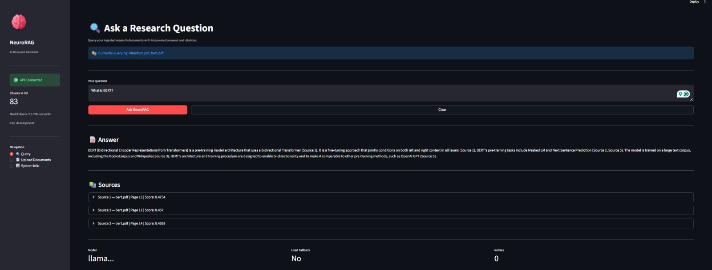
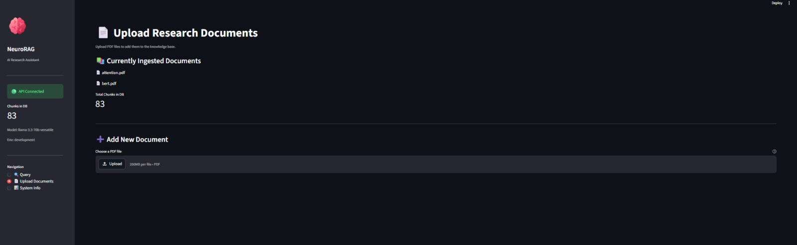
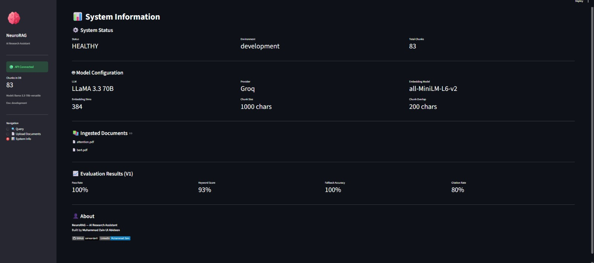

# 🧠 NeuroRAG — AI Research Assistant

<p align="center">
  
</p>

<p align="center">
  A production-grade Retrieval-Augmented Generation (RAG) system for querying research documents with grounded, citation-based answers powered by LangGraph and Groq LLaMA3.
</p>

<p align="center">
  
  
  
  
  
  
</p>

---

## 🎯 What It Does

NeuroRAG is an intelligent research assistant that:

- Ingests PDF research documents uploaded by the user
- Chunks and embeds them using sentence-transformers
- Stores embeddings persistently in ChromaDB
- Uses LangGraph for intelligent decision-making workflow
- Generates grounded answers with citations via Groq LLaMA3.3 70B
- Exposes everything via FastAPI REST API
- Provides a clean Streamlit UI for interaction

---

## 🖥️ UI Screenshots

### Query Page
Ask questions across multiple research papers with cited answers.


### Upload Page
Upload your own PDF documents — system ingests them automatically.


### System Info
Monitor chunks, models, evaluation scores and system health.


---

## ⚙️ Tech Stack

| Component | Technology |
|---|---|
| LLM | Groq LLaMA 3.3 70B |
| Embeddings | sentence-transformers (all-MiniLM-L6-v2) |
| Vector DB | ChromaDB 0.6.3 |
| Workflow | LangGraph 0.2.60 |
| Backend API | FastAPI 0.115 |
| Frontend | Streamlit 1.57 |
| Config | pydantic-settings |
| Logging | loguru |
| Testing | pytest |
| Environment | uv |
| Python | 3.11 |

---

## 🧠 LangGraph Workflow

```
Query → Analyze → Decision Gate
                    ↓
          Has relevant docs?
          ↙              ↘
        YES               NO
         ↓                 ↓
      Retrieve          Fallback
         ↓                 ↓
      Generate          Finalize
         ↓
      Validate
      ↙      ↘
   Good    Poor Quality
     ↓          ↓
  Finalize   Retry (max 2x)
```

---

## 📦 Project Structure

```
neuro-rag/
├── app/
│   ├── api/              # FastAPI routes and schemas
│   ├── core/             # Config, logging, exceptions, state
│   ├── ingestion/        # PDF loader, parser, chunker
│   ├── embedding/        # Sentence transformer embedder
│   ├── retrieval/        # ChromaDB vector store, retriever
│   ├── llm/              # Generator, prompt builder, LangGraph workflow
│   └── evaluation/       # Evaluation framework
├── data/
│   ├── raw/              # Input PDF files
│   └── processed/        # ChromaDB persistent storage
├── scripts/              # Ingestion pipeline script
├── tests/                # All test files (100% pass rate)
├── logs/                 # Application logs
├── streamlit_app.py      # Streamlit UI
├── .env                  # Environment variables
└── pyproject.toml        # Project dependencies
```

---

## 🚀 Setup & Installation

### 1. Clone the repository
```bash
git clone https://github.com/zainsardar0/neuro-rag.git
cd neuro-rag
```

### 2. Install uv (if not installed)
```bash
powershell -ExecutionPolicy ByPass -c "irm https://astral.sh/uv/install.ps1 | iex"
```

### 3. Create virtual environment and install dependencies
```bash
uv venv
.venv\Scripts\activate
uv sync
```

### 4. Configure environment

Add your Groq API key to `.env`:

```env
GROQ_API_KEY=your_groq_api_key_here
APP_NAME=NeuroRAG
APP_ENV=development
LOG_LEVEL=DEBUG
CHROMA_DB_PATH=./data/processed/chroma
```
GROQ_API_KEY=your_groq_api_key_here
Get a free API key at: https://console.groq.com

### 5. Ingest sample documents
```bash
python scripts/ingest.py --reset
```

### 6. Start FastAPI backend
```bash
uvicorn app.main:app --reload --port 8000
```

### 7. Start Streamlit UI
```bash
streamlit run streamlit_app.py
```

### 8. Open in browser
http://localhost:8501

---

## 🔌 API Endpoints

| Method | Endpoint | Description |
|---|---|---|
| GET | `/api/v1/health` | System health check |
| POST | `/api/v1/query` | Query the RAG system |
| POST | `/api/v1/upload` | Upload and ingest a PDF |
| GET | `/api/v1/documents` | List ingested documents |
| POST | `/api/v1/ingest` | Reingest all documents |

Interactive API docs: `http://localhost:8000/docs`

---

## 📊 Evaluation Results (V1)

| Metric | Score |
|---|---|
| Pass Rate | 100% |
| Avg Keyword Score | 93% |
| Fallback Accuracy | 100% |
| Citation Rate | 80% |

---

## ⚠️ Known Limitations (V2 Roadmap)

- Images and figures in PDFs not extracted
- Math equations partially parsed
- No query rewriting or hybrid search
- No caching layer (Redis planned)
- No user authentication/isolation

---

## 🔖 V2 Roadmap

- Table and image extraction (unstructured library)
- Query rewriting for better retrieval
- Hybrid search (keyword + semantic)
- CrossEncoder reranking
- Redis caching layer
- Full RAGAS automated evaluation
- User authentication and document isolation

---

## 🧪 Running Tests

```bash
pytest tests/ -v
```

---

## 👤 Author

**Muhammad Zain Ul Abideen**  
Student at GIKI (Ghulam Ishaq Khan Institute)

[](https://github.com/zainsardar0)
[](https://www.linkedin.com/in/muhammad-zain-ul-abideen-1705032b3/)
[](mailto:zainsardar062@gmail.com)

---

## 📄 License

This project is licensed under the MIT License.
